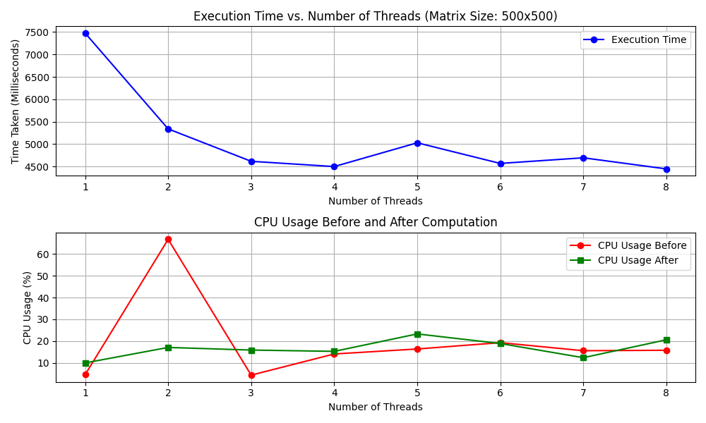

# Matrix Multiplication with Multi-threading

This project evaluates the performance of matrix multiplication using multi-threading in Python. It compares execution times for different thread counts when multiplying a constant matrix with several random matrices.

---

## Authors

- [@Guryansh](https://www.github.com/Guryansh)
  
## Features
- Matrix multiplication using `numpy.dot`.
- Parallel execution with `multiprocessing.Pool`.
- Performance evaluation for different thread counts (1 to 8 threads).
- Visualization of results with `matplotlib`.

---

## Requirements
- Python 3.x
- `numpy`
- `matplotlib`

Install dependencies:

```bash
pip install numpy matplotlib
```

---

## Code Overview
- `multiply_matrices`: Multiplies a constant matrix with another matrix using numpy.dot.
- `measure_execution_time`: Measures the time taken to perform matrix multiplication with a specified number of threads.
- `main`: Initializes random matrices, tests performance with different thread counts, and plots the results.

---

## Output
- Prints execution times (in milliseconds) for each thread count (1 to 8).
- Displays two graphs:
   1. **Execution Time vs. Number of Threads**: The time taken for matrix multiplication with different thread counts.
   2. **CPU Usage Before and After Computation**: The CPU usage before and after the computation for different thread counts.
---

## Result
- **Execution Time vs. Number of Threads**: Shows the impact of thread count on execution time for matrix multiplication.
- **CPU Usage**: Displays how CPU usage changes before and after the matrix multiplication process.



---

[](https://choosealicense.com/licenses/mit/)